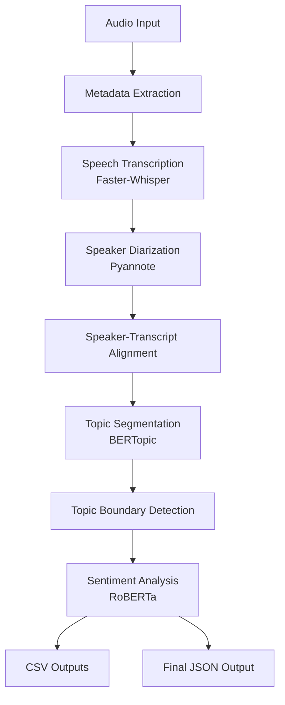

# 🎙️ Audio Intelligence System

> **Transforming long audio recordings into structured, actionable insights through speech recognition, speaker identification, topic segmentation, and sentiment analysis.**

An end-to-end modular AI pipeline built in **Google Colab** that goes beyond transcription by organizing conversations into meaningful information. The system combines **Faster-Whisper**, **Pyannote**, **BERTopic**, and **RoBERTa** to identify speakers, segment discussions into topics, detect topic boundaries, analyze sentiment, and produce structured outputs in both **CSV** and **JSON** formats.

---

## Project Overview

Most speech recognition systems stop after generating a transcript. While transcripts are useful, they still require significant manual effort to understand who spoke, when topics changed, and what the overall conversation was about.

This project was built to solve that problem by transforming long audio recordings into structured intelligence rather than plain text. Starting from a single audio file, the system extracts metadata, transcribes speech, identifies speakers, aligns speaker labels with transcripts, organizes conversations into meaningful topics, detects topic transitions, performs sentiment analysis, and exports the results in machine-readable formats.

The project follows a **modular architecture**, allowing each processing stage to operate independently. This makes the system easier to develop, debug, evaluate, maintain, and extend as newer models become available.

---

## Features

-  Audio metadata extraction
-  Speech transcription using Faster-Whisper
-  Speaker diarization using Pyannote
-  Speaker–transcript alignment using timestamp overlap
-  Topic segmentation using BERTopic
-  Topic boundary detection using cosine similarity
-  Sentiment analysis using RoBERTa
-  Structured CSV outputs
-  Machine-readable JSON export
-  Modular pipeline designed for maintainability and future upgrades

---

## System Architecture



---

## Technology Stack

| Category | Technology |
|----------|------------|
| Programming Language | Python |
| Development Environment | Google Colab |
| Speech Recognition | Faster-Whisper |
| Speaker Diarization | Pyannote Audio |
| Topic Modeling | BERTopic |
| Embedding Model | Sentence Transformers |
| Topic Boundary Detection | Cosine Similarity |
| Sentiment Analysis | RoBERTa (Hugging Face Transformers) |
| Data Processing | Pandas, NumPy |
| Evaluation | JiWER (Word Error Rate) |
| Output Formats | CSV, JSON |

---

## Repository Structure

```text
audio-intelligence-system/
│
├── notebooks/
│   └── Audio_Intelligence_System.ipynb
│
├── outputs/
│   └── final_audio_intelligence.json
│
├── report/
│   └── System_Design_Summary.pdf
│
├── images/
│   └── final_output.png
│
├── README.md
├── requirements.tx
```

---

##  Getting Started

### Prerequisites

Before running the notebook, ensure you have:

- A Google account to access Google Colab
- A Hugging Face account and access token (required for the speaker diarization model)
- An audio file (`.wav`) for analysis

### Installation

Clone the repository:

```bash
git clone https://github.com/<your-username>/audio-intelligence-system.git
cd audio-intelligence-system
```

Install the required dependencies:

```bash
pip install -r requirements.txt
```

---

##  Running the Project

1. Open the notebook in **Google Colab**.
2. Install the required dependencies.
3. Authenticate with your Hugging Face token.
4. Upload or mount the audio file from Google Drive.
5. Run the notebook sequentially from top to bottom.
6. The system will generate:
   - Audio metadata
   - Speech transcript
   - Speaker diarization
   - Speaker-transcript alignment
   - Topic segmentation
   - Topic boundary detection
   - Sentiment analysis
   - Final structured JSON output

The final output is saved as a machine-readable JSON file that consolidates the insights generated throughout the pipeline.

---

##  Sample Output

The system produces a consolidated JSON file that transforms raw audio into structured intelligence. Rather than returning only a transcript, the output combines metadata, speaker information, topic segmentation, topic boundaries, and sentiment analysis into a single machine-readable format.


A sample output is also available in:

```text
outputs/final_audio_intelligence.json
```

---

##  Evaluation

The primary quantitative evaluation focused on the speech transcription component using **Word Error Rate (WER)**.

| Metric | Value |
|---------|------:|
| Word Error Rate (WER) | **0.0762** |

A WER of **0.0762** indicates that the transcription model achieved good recognition performance on the evaluation audio, providing a reliable foundation for downstream tasks such as topic modeling and sentiment analysis.

The remaining modules—including speaker diarization, transcript alignment, topic segmentation, topic boundary detection, and sentiment analysis—were evaluated qualitatively by examining the logical consistency of their outputs. A more comprehensive evaluation using task-specific benchmark metrics is identified as future work.

---

##  Key Design Decisions

Several engineering decisions shaped the development of this project:

- **A modular pipeline** was chosen to simplify development, debugging, maintenance, and future upgrades.
- **Metadata extraction** was included as a supporting module to validate input audio and provide useful context before downstream processing.
- **Faster-Whisper** was selected because it balances transcription quality with speed and memory efficiency, making it suitable for long recordings in Google Colab.
- **Transcription** serves as the backbone of the pipeline. Most downstream modules depend on accurate transcripts.
- **Intermediate outputs** were saved throughout development to simplify debugging and allow individual modules to be inspected independently.
- **CSV and JSON exports** were included to support both human analysis and machine integration.
- The expected **number of speakers** was supplied during diarization because it was known for the available recording, improving consistency.
- The system was designed within **Google Colab resource constraints**, influencing model selection and implementation choices.

---

## Limitations

While the system successfully demonstrates an end-to-end audio intelligence workflow, several limitations remain:

- Only the transcription module was evaluated quantitatively.
- Speaker diarization currently assumes the expected number of speakers is known.
- Errors in transcription can affect downstream modules.
- Performance has only been validated on the available recording.
- Google Colab resource limitations restrict experimentation with larger models and longer recordings.

---

## Future Improvements

Future work could further strengthen the system by:

- Evaluating speaker diarization with standard diarization metrics.
- Benchmarking topic segmentation on public datasets.
- Supporting automatic speaker count estimation.
- Improving speaker alignment with confidence-aware matching.
- Adding confidence scores to predictions.
- Optimizing the pipeline for GPU deployment.
- Packaging the workflow as a reusable API or web application.
- Expanding evaluation across more diverse audio datasets.

---


##  Conclusion

This project demonstrates how a modular AI pipeline can transform long audio recordings into structured, actionable intelligence rather than simple transcripts. By combining speech recognition, speaker diarization, transcript alignment, topic modeling, topic boundary detection, and sentiment analysis, the system produces outputs that are easier to analyze, search, and integrate into downstream applications.

Beyond the individual AI models, the project emphasizes thoughtful system design. The modular architecture makes each component easier to develop, evaluate, debug, and improve independently, providing a flexible foundation for future enhancements while balancing performance with the practical constraints of Google Colab.

If you found this project interesting or have suggestions for improving the pipeline, I'd love to hear your feedback. Contributions, discussions, and ideas are always welcome.

---

